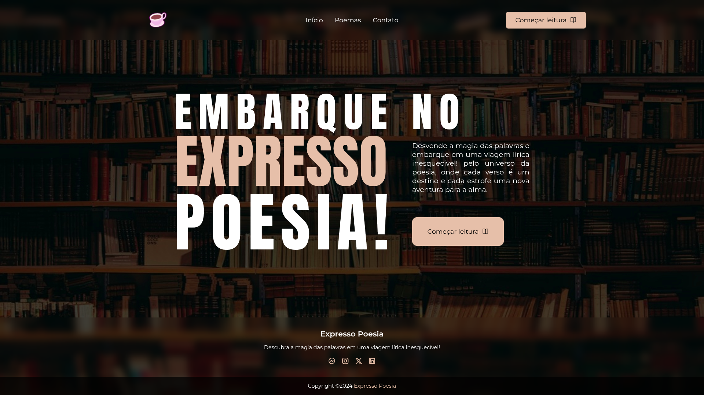

<h1 align="center">
    Expresso Poesia
</h1>

    Website for reading and appreciating poems!

  

## Content Table

- [Description](#description)
- [Preview](#preview)
- [Screenshot](#screenshot)
- [Contact](#contact)

## Description

Expresso Poesia is a website developed as a project for the Web Systems Development course. It showcases a collection of poems written by a student, providing a digital space for literary expression and appreciation.

## Preview

🔗 [Expresso Poesia - Preview](https://victor101106.github.io/Expresso-Poesia/)

## Screenshot

## Contact

Victor Gabriel • [Github](https://github.com/Victor101106/) • victorgabriel101106+github@gmail.com
